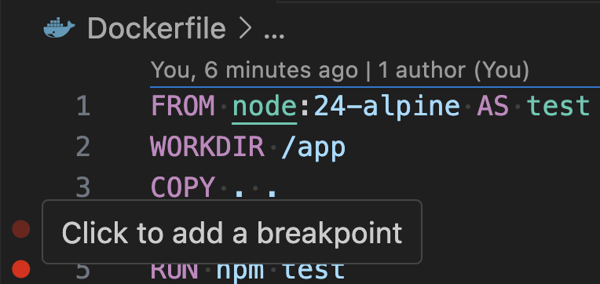
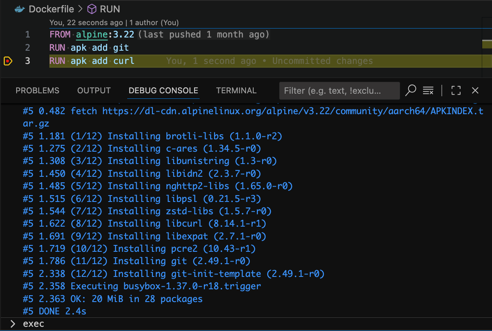
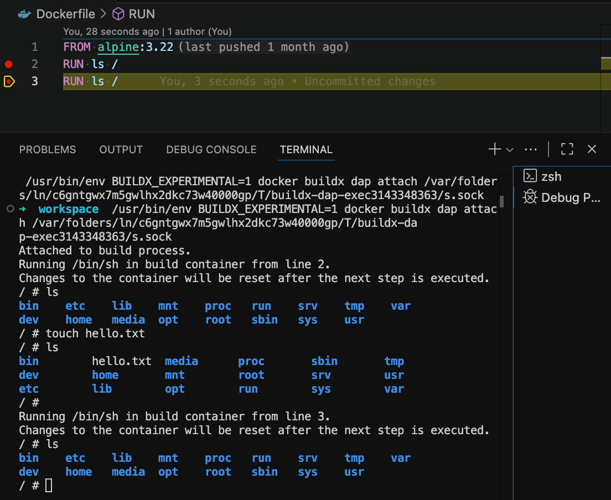
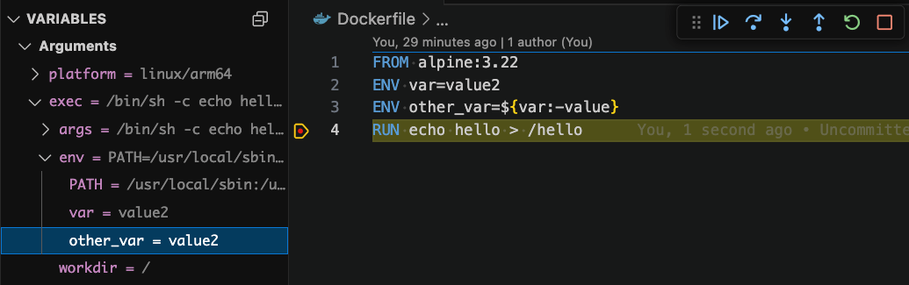

# Build Debugging

## Overview

[Buildx](https://github.com/docker/buildx) provides an implementation of the [Debug Adapter Protocol](https://microsoft.github.io/debug-adapter-protocol/). This means development tools that support and implement the Debug Adapter Protocol can interface with Buildx directly and step through its build process in real-time.

## Requirements

To use the build debugging feature, we recommend installing or updating to [Docker Desktop](https://docs.docker.com/install/) 4.46 or above. You may alternatively install Buildx manually by following the instructions [here](https://github.com/docker/buildx?tab=readme-ov-file#manual-download).

To _validate_ that your Buildx installation supports build debugging, run the following commands:

1. Run `docker buildx version` to check that your Buildx version is v0.28.0 or greater.
2. Run `BUILDX_EXPERIMENTAL=1 docker buildx dap` to check that the `dap` subcommand is available in your Buildx installation.

## Features

### Debugging without a Launch Configuration

The Docker DX extension will fill in a debug configuration on a best effort basis. If you do not have a `launch.json` file or if it does not define any launch configurations, you can start debugging by simply opening a Dockerfile and then clicking on the "Run and Debug" button in the "Run and Debug" side panel.


### Debugging with a Launch Configuration

For more complicated build configurations, you can use the `launch.json` to define launch configurations for the buildx debugger.

<!-- prettier-ignore -->
```jsonc
{
  "type": "dockerfile", // required, must not be modified
  "request": "launch", // required, must not be modified
  "name": "Docker: Build", // required, configurable
  "dockerfile": "Dockerfile", // required, configurable
  "contextPath": "${workspaceFolder}", // optional, defaults to ${workspaceFolder}
  "cwd": "${workspaceFolder}", // optional, defaults to ${workspaceFolder}
  "target": "test", // optional, should be a build stage in the Dockerfile
  "args": [
    // additional arguments for the build command
    "--build-arg",
    "NODE_ENV=development"
  ],
  "stopOnEntry": true, // if the debugger should suspend on the first line, defaults to false
}
```

### Setting Breakpoints

The build debugger integration supports setting line breakpoints on an instruction. Visual Studio Code offers various ways for setting a breakpoint which you can read more about [here](https://code.visualstudio.com/docs/debugtest/debugging#_breakpoints).



### Opening a Shell Inside the Image Being Built

> ⚠️ Note that this feature is still being fine tuned.

When crafting a Dockerfile in the beginning, it is common to make changes and rerun the build again and again. With the shell exec feature, you can quickly open a shell for the image you are building and test commands there before copying them back into your Dockerfile.

1. Set a breakpoint in the build.
2. When the build process has been suspended, open the Debug Console.
3. Type in `exec` and press <kbd>Enter</kbd>.
4. A new terminal with a shell inside the paused build image will be opened.




Note that message in the terminal that states:

```
Changes to the container will be reset after the next step is executed.
```

The following screenshot will illustrate this. We open a shell on line 2 and then use `touch hello.txt` to create a file. However, after advancing the debugger to line 3, the shell is reset and now `hello.txt` can no longer be found.



### Inspecting Variables

The Variables pane in Visual Studio Code lets you view the value of `ARG` and `ENV` variables. The pane can help clarify what a value is if variable substitutions are involved.



## Troubleshooting

If you encounter errors or issues with this feature, the DAP logs may help. Open the Output panel and select "Docker Buildx DAP" from the drop down.


If it is unclear what is wrong, please do not hesitate to [open an issue](https://github.com/docker/vscode-extension/issues) or [start a discussion thread](https://github.com/docker/vscode-extension/discussions).
